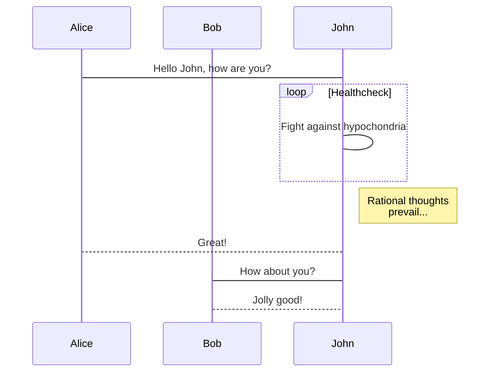
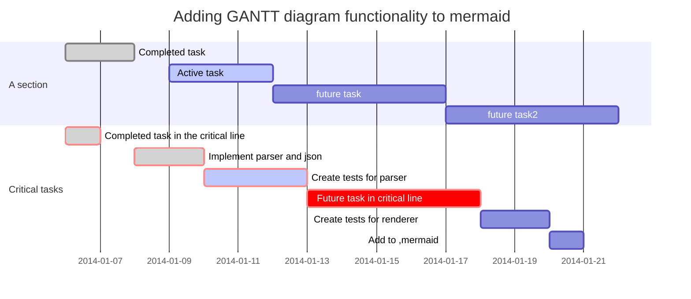
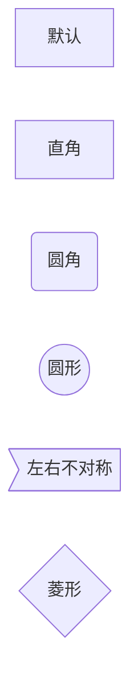
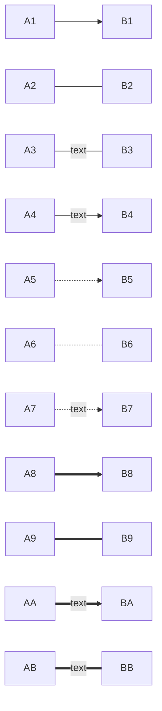

## MarkDown绘图
虽然markdown的语法中有流程图之类的语法，但是有些编辑器并不支持，
好在现在有种新的绘图插件mermaid，VSCode中也有相应的插件

[markdown绘图插件----mermaid简介](http://blog.csdn.net/wangyaninglm/article/details/52887045)

### 例子






### 语法
- 语句结尾可带可不带分号";"
- mermaid的语句需要像其他类型的代码一样，用"```"包裹起来，并用"mermaid"声明类型
- 第一句声明图表的类型
    - graph TB;普通图表，比如流程图，TB表示方向，可能的方向：
        - TB - top bottom 
        - BT - bottom top 
        - RL - right left 
        - LR - left right 
        - TD - same as TB
    - sequenceDiagram 时序表
    - gantt 甘特图
- 节点形状，声明节点的语句可以省略，节点的标题(title)也可以省略，标题两边的引号也可以省略，只要不造成误会就没问题
    - name
    - name["title"]
    - name("title")
    - name(("title"))
    - name>"title"]
    - name{"title"}
- 连接线
    - A-->B             箭头
    - A --- B           直线
    - A -- text --- B   带文字
    - A -- text -->B
    - A-.->B            虚线箭头
    - A-.- B
    - A-.text.->B
    - A==>B             粗实线箭头
    - A===B
    - A==text==>B
    - A==text===B

### 示例





其他功能有点多余了，别在意啦，能画个流程图就好~~~