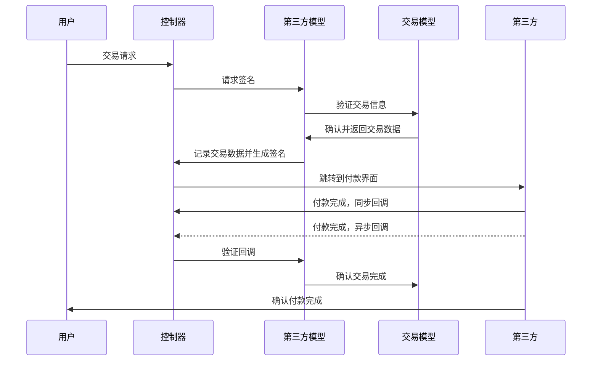
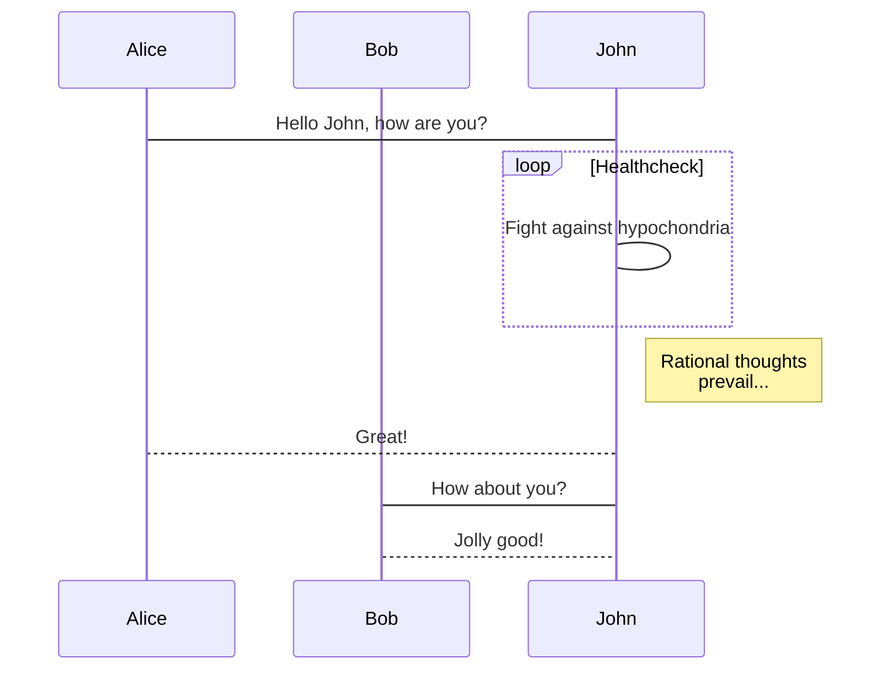

## 支付宝支付接口
开放平台：https://open.alipay.com/platform/home.htm

注意：支付宝的接口在不同的平台上是不能通用的，比如电脑网页支付就与APP支付的权限不能通用  
支付宝的接口主要分为两部分:
- AopClient
需要设置APPID等参数，用来处理和发送请求
- Request
不同的业务对应不同的请求类，只要创建业务对应的请求类，并且填入对应的参数，然后用AopClient发送请求就可以了

### 回调接口
支付宝的回调分为同步回调和异步回调
注意：
- 异步回调地址需http://格式的完整路径，不能加?id=123这类自定义参数
- 获取异步回调的参数时，不要用thinkphp的I函数，直接用$_POST否则有些内容会被转码导致验签失败
- base64格式的sign直接以GET方式发送的话，其中的"+"在有些服务器上会被改成" ",所以验签之前需要替换回来  
$data["sign"]=str_replace(" ","+",$data["sign"]);


同步回调数据(get)
```json
{
    "total_amount": "100.00",
    "timestamp": "2017-09-18 15:00:37",
    "sign": "rFX3iFrWhpOQe9ktz3qeLXRf2f1i7ywgv2Ez5x2byMJHS+aB\/BRDfgcGssF0wQHr3lFlr61WGtjvf3aUC9pfRlDTKxON\/9PE932B21Q1XIoHXGxx8iaOav9Dc48bmhSpXh\/a1lUJMaDc1iHc7Ug2Q1VxNx2LsQPnrCw8Ym63TWF5BjR83OieqZz0c0hYw5pPHpQM+341JqXuMR5ZxkLJBB6523w\/xdqlMML4qvJhNRgqpITtBga3BWoy5CSjgRaaWuoM7x0lbHBUqu7hgyDv+FnDNQIy8fT0ciAVjtB3a0f7nuOkIHKrzQsaXh3Qb54P10RsYQ0RkwdcM5dXS3lY5g==",
    "trade_no": "2017091821001004930200329341",
    "sign_type": "RSA2",
    "auth_app_id": "2016080800193517",
    "charset": "UTF-8",
    "seller_id": "2088102170444333",
    "method": "alipay.trade.page.pay.return",
    "app_id": "2016080800193517",
    "out_trade_no": "2017918145936267",
    "version": "1.0"
}
```

异步回调数据(post)
```json
{
    "gmt_create": "2017-09-18 15:00:21",
    "charset": "UTF-8",
    "gmt_payment": "2017-09-18 15:00:30",
    "notify_time": "2017-09-18 15:00:31",
    "subject": "\u6d4b\u8bd5",
    "sign": "NatxDrSFLLOuZpdy5Hj8bM1RrCf7ifTXWZm78tELw0K0unJSnC6cuCChSutMNUAZ+bZPUkQIYJL38skCz3oWPO9eerBuMPP0d7m4XJLPkpGLOinSEKoARDDTkZtXdIrbAw5GbkKKKqOl0JLBJiORti6xAw0insKs3\/FXfLi3PMY+GHvBTkU39HnPsLCq2whxuymrgb0WwPNy1M4hdRPgQ2fJhuL5kUXCn9rVzAiKPftXq\/CneBWhTDnldn1d9Vi5cl86vwcJPhfWdwcv6nNTdfkaZKf5wa3zqJP0\/3cvE9RXbfOdWbumMrKZCyEGjMKyWicgtO1be9FFG+xtNtsDwA==",
    "buyer_id": "2088102173187930",
    "body": "\u6d4b\u8bd5\u4e00\u4e0b\u63a5\u53e3",
    "invoice_amount": "100.00",
    "version": "1.0",
    "notify_id": "18d9a15ca64dbfaff1cba501ef8d428n6e",
    "fund_bill_list": "[{\"amount\":\"100.00\",\"fundChannel\":\"ALIPAYACCOUNT\"}]",
    "notify_type": "trade_status_sync",
    "out_trade_no": "2017918145936267",
    "total_amount": "100.00",
    "trade_status": "TRADE_SUCCESS",
    "trade_no": "2017091821001004930200329341",
    "auth_app_id": "2016080800193517",
    "receipt_amount": "100.00",
    "point_amount": "0.00",
    "app_id": "2016080800193517",
    "buyer_pay_amount": "100.00",
    "sign_type": "RSA2",
    "seller_id": "2088102170444333"
}
```

### 业务流程
用户通过APP或者网页发送请求-->
服务器检查请求，创建交易记录，并将交易签名返回给APP，或者直接发起交易-->
(APP端发起交易-->)
用户确认交易-->
接收同步通知，并记录时间
接收异步通知，并记录时间

### 交易模块结构
将交易模块整个拿出来作为一个模块，其中包括
- 与支付宝等第三方机构交互的model
- 负责不同种类交易的model
- 负责转发用户请求和第三方回调的控制器



交易记录表
id
trade_no        out_trade_no
alipay_trade_no trade_no
trade_type      交易类型(内部)
name            subject
total           total_amount
description     body
time            创建时间
return_status   同步通知状态
return_time     同步通知时间
notify_status   异步通知状态
notify_time     异步通知时间
trade_data      交易数据(json格式，包含用户id之类的数据)


### thinkphp版本的代码导入需要
- 入口文件       thinkphp\trade.php 需要根据实际需要调用的位置修改设置
- SDK           thinkphp\ThinkPHP\Library\Vendor\Alipay
- 导入数据库
- Trade模块

F:\GDDocument\framework\thinkphp\Application\Home\Controller\
/yjdata/www/www/tpdemo/Application/Home/Controller

F:\GDDocument\framework\thinkphp\ThinkPHP\Library\Vendor\Alipay\
/yjdata/www/www/tpdemo/ThinkPHP/Library/Vendor/Alipay

/yjdata/www/www/tpdemo/Application/Runtime/Logs